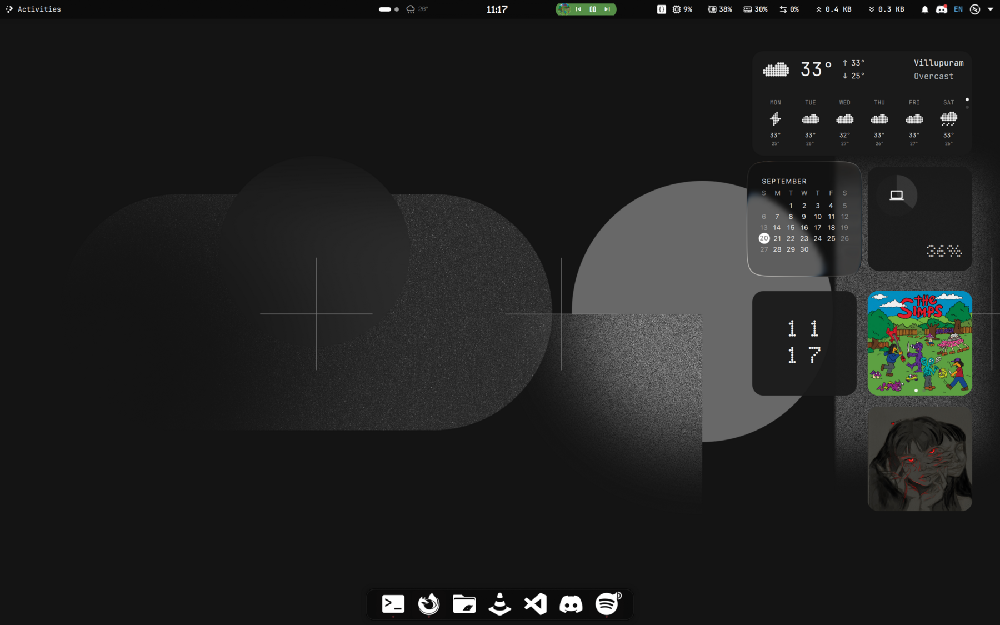
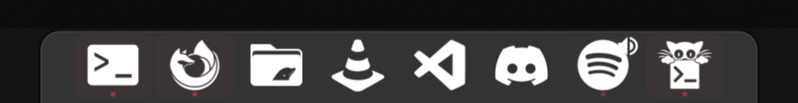
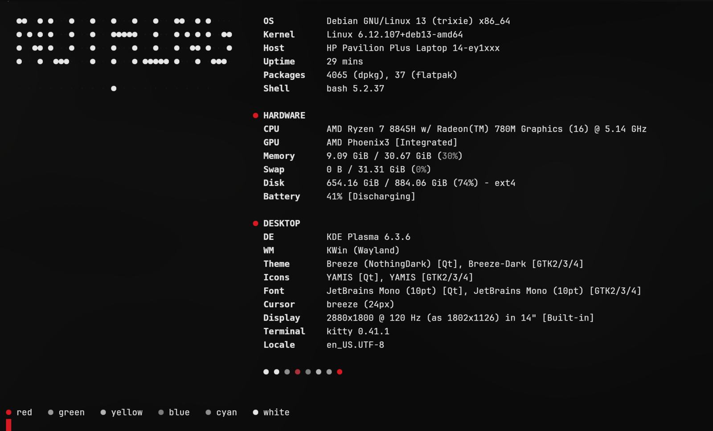
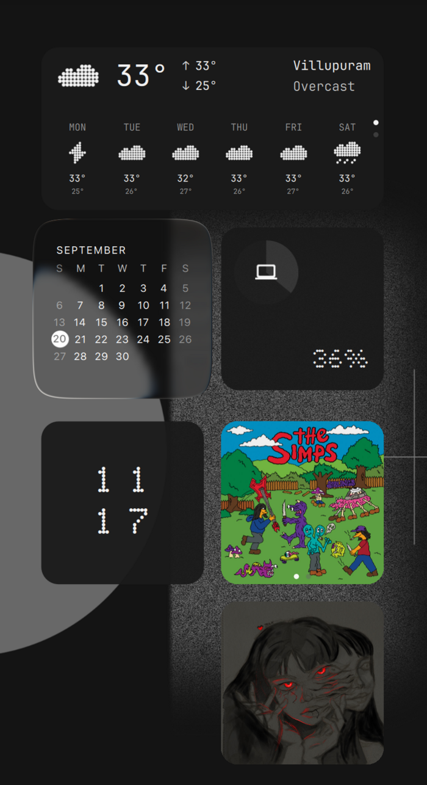
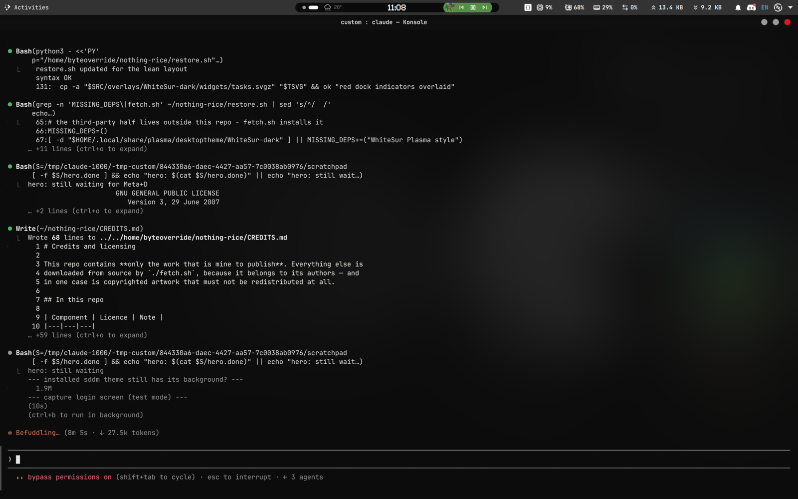

# Nothing OS - KDE Plasma 6

A Nothing-OS-themed Plasma 6 desktop: monochrome, near-black, one red accent.
GNOME-style top bar, a floating macOS-style dock, Nothing widgets on the right,
and a matching login screen.



---

## Install

```bash
git clone https://github.com/byteoverride/nothing-rice.git
cd nothing-rice
./fetch.sh      # download the third-party pieces (widgets, icons, WhiteSur, font)
./restore.sh    # apply everything
```

Then log out and back in.

`fetch.sh` is separate on purpose - the widgets, icon theme, WhiteSur style and
font belong to their authors and are pulled from source rather than vendored
here. The Nothing wallpapers are copyrighted artwork and are **never**
redistributed. See [CREDITS.md](CREDITS.md).

```bash
./fetch.sh --no-font       # skip the 78MB Nerd Font
./restore.sh --no-sddm     # skip the login screen (no sudo needed)
./restore.sh --yes         # no prompts
./rollback.sh              # undo a restore
./rollback.sh --list       # show rollback points
./backup.sh                # re-snapshot your current setup into files/
```

`restore.sh` snapshots your existing setup to `~/.nothing-rice-rollback/<stamp>`
**before** overwriting anything, so `rollback.sh` can put it back.

---

## What it looks like

**Top bar** - Activities, the Nothing Dynamic Island centred, then a code-snippet
button, live CPU/GPU/RAM/network, and a deliberately minimal tray.


**Dock** - floating, centred, dodges windows. Background and minimised apps get a
**red** indicator dot; the active window keeps white.



**Terminal** - kitty, near-black with blur, monochrome palette where red is the
only colour. fastfetch with a dot-matrix `NOTHING` logo.



**Widgets** - a two-wide column on the right: weather, calendar, battery,
dot-matrix clock, media, notifications and a photo frame.



**Login** - the WhiteSur macOS layout restyled: same wallpaper as the desktop,
JetBrains Mono, dark password pill with a red focus ring.



---

## The setup

| | |
|---|---|
| Plasma style | WhiteSur-dark |
| Colour scheme | NothingDark - `#0a0a0a`, red `#d71921` |
| Icons | YAMIS (monochrome) |
| Font | JetBrains Mono 10 / JetBrainsMono Nerd Font |
| Decoration | **Nothing Dots** - monochrome circles, red close, right side |
| Effects | Blur, strength 12 |
| Terminal | kitty 0.41 |
| Login | **NothingLogin** SDDM theme |
| Tiling | **KZones** - Windows-11-style snap layouts |

### Layout
- **Top bar** - Activities · Dynamic Island · `{}` snippets · SysPeek · tray
- **Dock** - 10 pinned apps, floating, centred, dodge-windows
- **Desktop** - 7 widgets in a two-wide column: weather, calendar, battery,
  dot-matrix clock, media, notifications, photo frame

The tray shows only network, battery and notifications. Bluetooth, volume,
brightness and the rest live behind the expander arrow, GNOME-style.

### Snap layouts

KZones gives you Windows-11-style snap layouts. Drag a window and a zone picker
appears; drop it into a zone. Seven layouts ship with this setup:

| Layout | Split |
|---|---|
| Halves | 50 / 50 |
| Two thirds + third | 66 / 34 |
| Thirds | 33 / 33 / 33 |
| Priority grid | 25 / 50 / 25 |
| Main + stack | 66, with 34 split top and bottom |
| Quadrants | 2 x 2 |
| Full | single zone |

| Shortcut | Does |
|---|---|
| drag a window | show the zone picker |
| `Meta+Space` | snap every window into the current layout |
| `Meta+Shift+Space` | snap just the active window |
| `Ctrl+Alt+D` | cycle layouts |
| `Ctrl+Alt+Left/Right` | move the active window between zones |
| `Ctrl+Alt+Up/Down` | cycle windows inside one zone |
| `Meta+Num 1-9` | jump to layout N |

Plasma 6.3 also has custom tiling built in: `Meta+T` opens a tile editor and
`Meta+arrow` quick-tiles. KZones adds the visual picker on top.

### Colours are split three ways
| Surface | Scheme | Background |
|---|---|---|
| Panel, desktop, widgets | NothingDark | `#0a0a0a` |
| Konsole | NothingDark | `#0a0a0a` |
| Dolphin, Kate, Ark, Gwenview, Okular, Spectacle, System Settings, KCalc | NothingVSCode | `#1e1e1e` / `#242424` |

Plasma 6 panels **always** follow the global scheme - plasmashell ignores per-app
`[UiSettings] ColorScheme` overrides even though Konsole honours them. That's why
the apps are pinned individually instead of the panel.

---

## Things that cost me time

**Aurorae paints its own titlebar** and ignores the colour scheme entirely.
Switching decorations moved titlebars from `#080808` to `#343434`; the fix is
recolouring the theme's own `decoration.svg`, not the scheme.

**Plasma caches theme SVGs hard.** Editing a theme file changes nothing visible
until `~/.cache/plasma_theme_*.kcache` and `ksvg-elements` are cleared and
plasmashell restarts. `restore.sh` does this.

**Dock indicator colours aren't inline.** They paint with `fill="currentColor"`
and a `ColorScheme-*` class that Plasma resolves at runtime, so the red is done
by switching `normal-*`/`minimized-*` to `ColorScheme-NegativeText` - which
resolves to the scheme's own red. Change the red in one place and the dots follow.

**`config.color` in the SDDM theme is the password text colour**, not just a
background. Setting it near-black makes typing invisible.

**Per-app colour pins are merged, not copied.** Shipping whole rc files would
carry recent-file history and clobber your app settings, so `restore.sh` writes
just the one key with `kwriteconfig6`.

---

## Caveats

**Screen resolution.** Desktop widget positions are stored per-resolution
(`ItemGeometries-<W>x<H>`) for the size recorded in `files/MANIFEST`. On a
different screen the column lands wrong - `restore.sh` warns when it detects a
mismatch. Drag them into place, or regenerate the grid.

**Different username.** `restore.sh` rewrites the bundle's original `$HOME` to
yours in the files that carry absolute paths.

**Apps that theme themselves** - VS Code, Firefox, Chrome, Discord, Spotify,
Obsidian, Ghidra - ignore the KDE scheme entirely and keep their own settings.

**New KDE apps** come up near-black rather than grey until you add
`[UiSettings] ColorScheme=NothingVSCode` to their rc file.

**ibus and remmina** publish their own tray icons, which KDE's hidden-items list
cannot control. Turn those off in the apps themselves.

---

## Licence

GPL-3.0. Three components here are derivative works of
[WhiteSur-kde](https://github.com/vinceliuice/WhiteSur-kde) (GPL-3.0), so the
copyleft carries over. Full attribution in [CREDITS.md](CREDITS.md).
